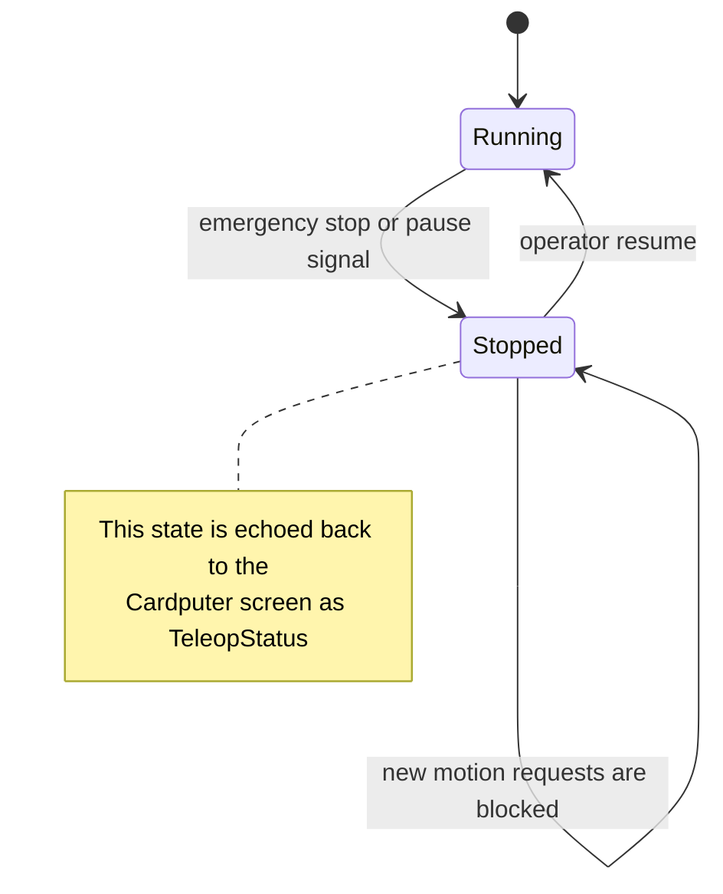

This post explains how the project reaches each goal from
[Part 1: Project Goals](../project-goals/). It stays at the design level.
For exact interfaces, field names, and versions, see
[Part 3: Technical Specification](../technical-specification/).

## The full pipeline, in one picture

```mermaid
flowchart LR
    KB[Cardputer keyboard] -->|WiFi / micro-ROS| AGENT[micro-ROS Agent]
    AGENT -->|/cardputer/input| TR[CardputerTranslator]
    TR --> MI[MoveIntent]
    MI --> SG[SafetyGate]
    SG -->|goal resolution| RESOLVE["Resolve full goal<br/>(uses filtered /joint_states)"]
    RESOLVE -->|FollowJointTrajectory| JTC[joint_trajectory_controller]
    JTC --> HW[SoArmHardware plugin]
    HW -->|serial write| ESP[ESP32 driver]
    ESP --> SERVOS[6x STS3215 servos]
    SERVOS -.->|feedback| ESP
    ESP -.->|serial read| HW
    HW -.-> JSB[joint_state_broadcaster]
    JSB -.->|/joint_states| RESOLVE
```

Each section below explains one stage of this picture in more detail.

## Wireless input without a wired connection

**Goal:** control the arm with a wireless keyboard.

The M5 Cardputer runs firmware that reads its own keyboard and sends the
key state over WiFi, using a protocol called micro-ROS. A small bridge
program, the micro-ROS Agent, receives this WiFi traffic and turns it into
a normal ROS2 topic. From this point, the key state looks like any other
ROS2 message. The rest of the system does not need to know that the input
came over WiFi.

## Turning key presses into safe motion

**Goal:** move the arm smoothly and safely from raw key presses.

A single node, `teleop_node`, owns this whole step. It works in stages:

1. **CardputerTranslator** reads the raw key state and turns it into a
   motion request, called a `MoveIntent`.
2. **SafetyGate** checks the request. It looks for the emergency-stop
   signal first, and also tracks pause/resume state. If the arm is
   stopped or paused, no motion request goes through.
3. **Goal resolution** takes the approved motion request and combines it
   with the arm's current joint positions. The current positions come
   from a filtered version of `/joint_states`, so a single noisy sensor
   reading cannot cause a sudden, wrong move.

This staged design keeps each concern separate: reading input, checking
safety, and computing the final goal are three different steps, each easy
to test on its own.

A second translator, `JoystickTranslator`, follows the same three stages,
so a joystick can produce a `MoveIntent` the same way the keyboard does.
It exists in code today, but no one has tested it by moving the real arm
yet.

## Moving the physical arm through standard ROS2 tools

**Goal:** use standard ROS2 control instead of a custom script.

The final goal from `teleop_node` is sent as a standard ROS2 action,
`FollowJointTrajectory`, to the `joint_trajectory_controller`. This
controller is part of the standard `ros2_control` framework, not custom
code. It talks to a hardware plugin, `SoArmHardware`, through the same
interface any ROS2 hardware plugin uses.

The `SoArmHardware` plugin is the only part of the system that knows about
the real servos. It:

- Clamps every joint command to safe limits, taken from the robot's URDF
  file.
- Sends the final command over a serial link to an ESP32 board, which
  drives the six STS3215 servos.
- Reads servo position back over the same serial link, and publishes it
  through `joint_state_broadcaster` as `/joint_states`.

Because this plugin follows the standard `ros2_control` interface, the
rest of the system does not need to change if the servos or the driver
board change later.

## Emergency stop as a signal that cannot get lost

**Goal:** make sure the operator can always stop the arm.

The emergency-stop signal is not mixed into the list of pressed keys. It
has its own dedicated field in the input message. This choice avoids a
real risk: if the stop signal were just one more entry in a list, a bug in
reading or matching that list could silently drop it. A dedicated field
means every part of the code must check it directly, and cannot miss it
by accident.

`SafetyGate` checks this field before anything else. It also **latches**
the stop and pause state, so the arm stays stopped until the operator
clearly resumes it. The current status, including stop and pause state, is
sent back to the Cardputer over the same WiFi link, so the operator always
sees the arm's real state on the small screen.

## Overhead vision on a platform without standard camera support

**Goal:** show a live camera feed, ready for future perception work.

The standard ROS2 camera driver, `usb_cam`, only works on Linux, because
it depends on a Linux-only video interface (V4L2). This project runs on
macOS, so `usb_cam` cannot be used. Instead, a small custom node,
`camera_node.py`, reads the camera directly through OpenCV's macOS
backend (AVFoundation), and publishes the image as a standard ROS2 image
topic. Any ROS2 tool that shows images, like RViz or `rqt_image_view`, can
use this topic without knowing it came from a non-standard driver.

## One repository per responsibility

**Goal:** keep the project easy to understand and change.

The project code is split into six repositories, each with one clear job:
arm description, hardware plugin, shared message definitions, teleop
logic, keyboard firmware, and camera. The top-level `so_arm_project`
repository does not hold any of that code. It only holds a `vcstool`
manifest file that lists the six repositories, plus the architecture notes
that explain how they connect. This keeps the "front door" of the project
small and lets each part of the system change on its own.
