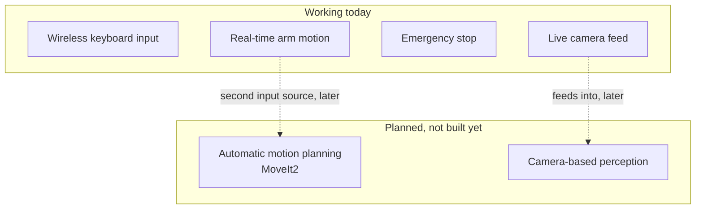

## What this project does

This project controls a 6-DOF robot arm (SO-ARM101) in real time. The
operator uses a small wireless keyboard, the M5 Cardputer. The keyboard
sends key presses over WiFi. The system turns these key presses into
smooth arm motion. An overhead camera also watches the workspace, ready
for future use.

The dotted arrows show where today's work connects to future work: the
camera feed is a first step toward perception, and the motion path already
leaves room for a second, automatic source of motion commands.

## Main goal

Move the robot arm with a wireless keyboard, using standard ROS2 tools.

Most small robot arm projects use custom scripts to talk to servos
directly. This project does not do that. It uses `ros2_control`, the
standard ROS2 way to control hardware. This choice has two benefits:

- The same controllers, safety checks, and tools work for this arm as for
  any other ROS2 robot.
- Other ROS2 features, like motion planning, can connect to the arm later
  without changes to the low-level control code.

## Supporting goals

### Safe operation

The operator must be able to stop the arm at any time. An emergency stop
must never get lost or delayed, even if the WiFi link is busy or the
keyboard sends many other key presses at the same time.

### Live camera feed

An overhead camera watches the arm and the workspace. Today, the feed is
only for viewing. It is early groundwork for pick-and-place tasks, where
the robot picks up objects it sees.

## Non-goals for now

These features are planned, but not built yet:

- **Automatic motion planning.** A future MoveIt2 layer will let the arm
  compute its own paths. Today, all motion comes from direct operator
  input.
- **Camera-based perception.** The camera does not yet detect objects or
  guide the arm. It only shows a live video feed.

The current code already leaves room for these features. For example, the
teleop node already accepts more than one input source in code — a
joystick path exists alongside the keyboard, though it hasn't been tested
on the real arm yet. But no perception or planning code exists yet.

## Why this matters

The project shows that a low-cost robot arm and a cheap wireless keyboard
can work together with the same tools used in professional robotics. It
also builds a stable base. Future work, like automatic planning or
computer vision, can build on top of this base without rewriting the core
control path.

---

Next: [Part 2 — how each goal is solved](../design-solutions/), and
[Part 3 — the technical specification](../technical-specification/).
