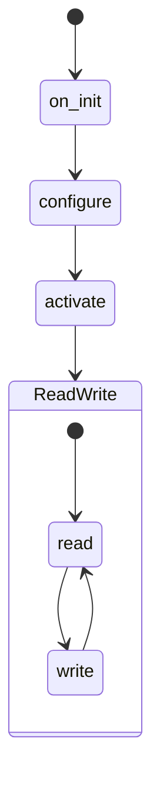
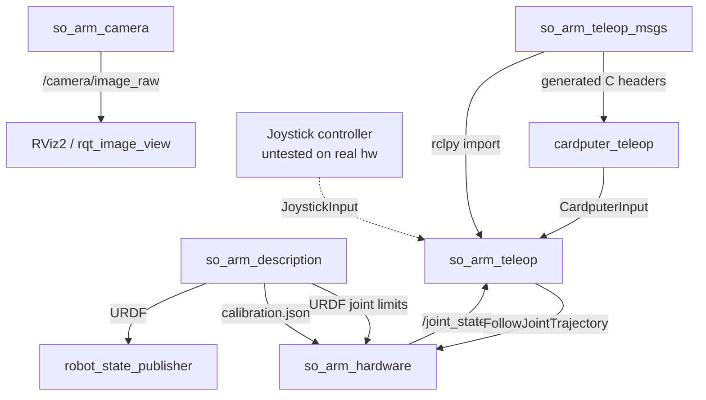

This post lists the exact technical details of the project: platform,
firmware, hardware plugin, messages, and camera. For the reasons behind
these choices, see [Part 2: How the Pieces Fit Together](../design-solutions/).

## Platform

| Item | Value |
|---|---|
| Host OS | macOS |
| Middleware | ROS 2 Humble |
| Control framework | `ros2_control`, patched build (cherry-picks upstream PR #2391, fixes a macOS `libc++abi` crash) |
| Bridge to firmware | micro-ROS Agent, built from source, `udp4` transport, port 8888 |
| Build tools | `ament_cmake` (hardware plugin), `ament_python` (teleop, camera) |

The patched `ros2_control` build and the micro-ROS Agent build are not
separate repositories. They are build-time overlays. The `ros2_control`
patch is set up and documented inside the `so_arm_hardware` repository.
Where the micro-ROS Agent build steps are written down is still unclear —
none of the six repositories has been found to hold them yet.

## Firmware — `cardputer_teleop`

| Item | Value |
|---|---|
| Board | M5Stack Cardputer (M5StampS3 core, ESP32-S3FN8) |
| Framework | Arduino, built with PlatformIO |
| micro-ROS transport | WiFi, ROS distro `humble` |
| Key libraries | `micro_ros_platformio`, M5Unified 0.2.19, M5Cardputer 1.1.1 |
| Serial monitor speed | 115200 baud |
| Upload speed | 460800 baud |
| Build flag | `ARDUINO_USB_CDC_ON_BOOT=1` |
| `CardputerInput` publish rate | Fixed 20 Hz. `SafetyGate` on the ROS2 side runs at 5 Hz, so it is the real rate bottleneck, not the firmware or WiFi link |
| `TeleopStatus` publish rate | On change only (event-driven), not polled |
| Message source | `so_arm_teleop_msgs` is pulled live from its GitHub `main` branch at every build, through PlatformIO's `extra_packages`/`vcs import` mechanism, so the firmware always builds against the current message definitions |

The build flag is needed because ESP32-S3 boards with native USB do not
send `Serial.println()` output over the same USB cable used for flashing
by default. This flag turns that output on.

## Hardware plugin — `so_arm_hardware`

| Item | Value |
|---|---|
| Interface type | `hardware_interface::SystemInterface`, loaded through `pluginlib` |
| Lifecycle stages | `on_init` → `configure` → `activate` → `read`/`write` |
| Link to servos | Serial connection to an ESP32/Waveshare driver board |
| Servos | 6x STS3215 |
| Serial protocol | Newline-delimited ASCII CSV, `id:ticks` pairs. ESP32 reports position at about 20 Hz; the control loop itself runs at 50 Hz and keeps only the newest buffered line. Write commands (`W`) include only the servo IDs that changed |
| Joint-to-servo ID map | Fixed: Rotation=1, Pitch=2, Elbow=3, Wrist_Pitch=4, Wrist_Roll=5, Jaw=6 |
| Safety behavior | Clamps every joint command to the limits defined in the URDF file |
| Extra behavior | Suppresses an echoed value right after activation if it lands within 5 ticks of the last real reading, to avoid a false jump |
| Diagnostic tool | `verify_resource_manager` (with a `--writeback` flag): a standalone test that talks to `ResourceManager` directly, bypassing `controller_manager` entirely |
| Key dependencies | `hardware_interface`, `pluginlib`, `rclcpp`, `rclcpp_lifecycle`, `urdf`, `nlohmann-json`, `ament_index_cpp`, `lifecycle_msgs` |

`read` and `write` run in a loop while the plugin is active: `read` pulls
the latest servo positions over serial, and `write` sends the next
clamped joint command.

## Description and calibration — `so_arm_description`

| Item | Value |
|---|---|
| URDF file | `so101_new_calib.urdf` |
| Joint name config | `joint_names_so_arm_urdf.yaml` |
| Calibration script | `calibrate.py` |
| Calibration output | `calibration.json` (not stored in git) |

The calibration file stores `offset_ticks` and `direction` values for each
joint. The hardware plugin reads this file and uses these values to
convert between raw servo ticks and real joint angles.

A second script, `joint_state_publisher_hw.py`, reads the ESP32 over serial
directly and publishes `/joint_states` on its own, using the same
`calibration.json` file. It is a standalone calibration/visualization
tool, wired up through `launch/display.launch.py` with
`robot_state_publisher` and RViz2. It is a separate path from the live
`ros2_control` loop described above — the two do not run against each
other, and only one should be active at a time.

## Message definitions — `so_arm_teleop_msgs`

### `CardputerInput.msg`

Keyboard state from the M5 Cardputer, sent over micro-ROS.

| Field | Type | Meaning |
|---|---|---|
| `header` | `std_msgs/Header` | Standard timestamp and frame info |
| `pressed_keys` | `string[]` | Names of keys currently pressed (for example `"w"`, `"space"`) |
| `emergency_stop` | `bool` | Emergency-stop signal, sent as its own field |

The `pressed_keys` field uses key names, not a bitmask or a fixed-position
array. This avoids the need for a separate table that maps positions to
keys, kept in sync between the firmware and the ROS2 code by hand.

The `emergency_stop` field is separate from `pressed_keys` on purpose. A
bug in reading a list cannot silently remove this signal, because it is
not part of that list.

### `JoystickInput.msg`

A second input source, alongside the Cardputer keyboard. The
`JoystickTranslator` code that consumes this message exists in
`so_arm_teleop`, but this path has not been tested on the real arm yet.

| Field | Type | Meaning |
|---|---|---|
| `header`, `seq` | `Header`, `uint32` | Timestamp and message counter |
| `stick_left_x`, `stick_left_y`, `stick_right_x`, `stick_right_y` | `float32` | Stick positions, from -1.0 to +1.0, normalized in firmware |
| `stick_left_sw`, `stick_right_sw` | `bool` | Stick click-button state |
| `mode`, `home`, `wrist_roll_plus`, `wrist_roll_minus`, `jaw_open`, `jaw_close` | `bool` | Raw button state, true while held down |
| `emergency_stop` | `bool` | Emergency-stop signal, same design as in `CardputerInput` |

The button fields report raw, held-down state, with no press/release
detection. Detecting a single press, for example to toggle a mode, is left
to the translator code in `so_arm_teleop`, not the firmware.

### `TeleopStatus.msg`

Status sent back to the Cardputer, to show on its screen.

| Field | Type | Meaning |
|---|---|---|
| `header` | `std_msgs/Header` | Standard timestamp and frame info |
| `mode` | `string` | Current mode, for example `"teleop"`, `"paused"`, `"error"` |
| `status_text` | `string` | One line of text, shown directly on the 1.14-inch screen |
| `requires_confirmation` | `bool` | True if the operator must confirm or deny an action |
| `confirmation_prompt` | `string` | Text to show for that confirmation |
| `confirmation_token` | `string` | ID used to match a later confirmation reply to this request |

The `mode` field is a plain string, not a fixed list of values. The set of
modes is still expected to grow, for example when a planning layer is
added.

The confirmation fields exist in the message. `StatusReporter` has a stub
method for sending a confirmation request, but it does nothing yet.
There is no decided way for the Cardputer to send a confirmation reply
back to the system.

## Camera — `so_arm_camera`

| Item | Value |
|---|---|
| Camera model | InnoMaker U20CAM-720P |
| Backend | OpenCV, using the AVFoundation backend |
| Output topic | `/camera/image_raw` |
| Lens calibration | `camera_info` comes from a real checkerboard calibration done on 2026-08-24 (9x6 corners, 25 mm squares, 1280x720), loaded from `config/camera_info.yaml`. If that file is missing or does not match the current resolution, the node falls back to the old FOV-guess values |
| Open item | `base` → `camera_link` mount position: still not measured, placeholder value, since the camera is not physically mounted yet |
| Known caveat | The 25 mm checkerboard square size was never checked with calipers, so it is a nominal value, not a measured one. The calibration is no longer valid if the manual focus ring is touched |

The standard ROS2 camera driver, `usb_cam`, is not used. It depends on
V4L2, a Linux-only video interface, so it does not work on macOS.

## Repository overview

| Repository | Role |
|---|---|
| `so_arm_description` | URDF model, meshes, calibration script and data, `robot_state_publisher` launch file, plus a standalone `joint_state_publisher_hw.py` calibration/visualization tool |
| `so_arm_hardware` | `hardware_interface::SystemInterface` plugin, serial link to the ESP32/Waveshare driver, `verify_resource_manager` diagnostic tool |
| `so_arm_teleop_msgs` | Shared message definitions: `CardputerInput`, `JoystickInput`, `TeleopStatus` |
| `so_arm_teleop` | `teleop_node`: turns Cardputer or joystick input into arm motion, through `dispatch_intent()`, `MoveIntent`, `SafetyGate`, and a trajectory executor |
| `cardputer_teleop` | PlatformIO/Arduino firmware for the M5 Cardputer, micro-ROS client over WiFi |
| `so_arm_camera` | `camera_node.py`, overhead camera driver for macOS |

All six repositories are private, under the `bogomaz-robotic` GitHub
account. The top-level `so_arm_project` repository only stores the
`vcstool` manifest file that lists them and the docs that describe how
they connect.
